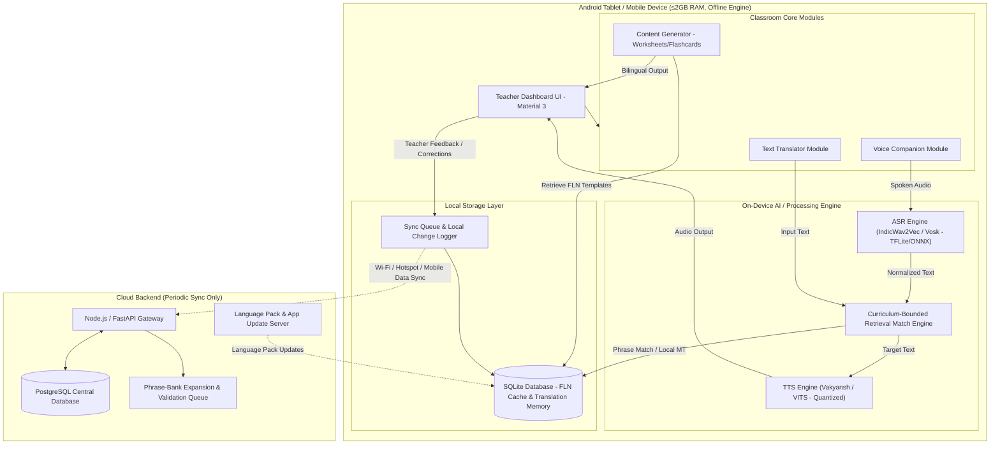
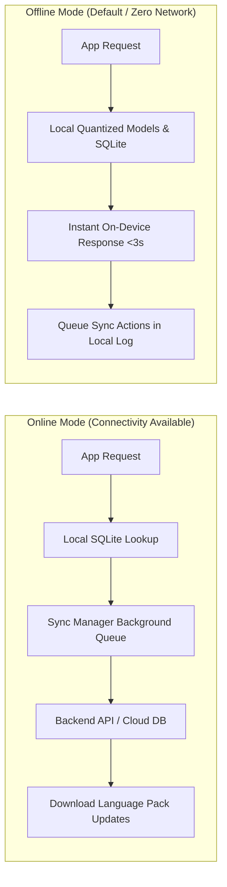
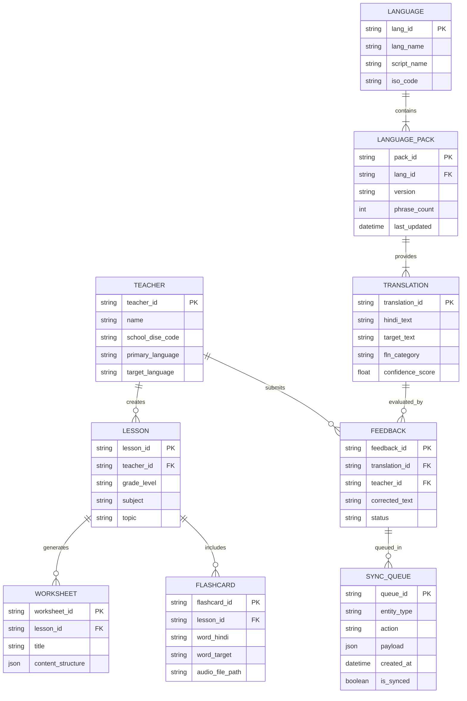

# VANVAANI — Architecture & Technical Specifications

**Project Name:** VANVAANI  
**Tagline:** Every Language. Every Classroom.  
**SIH Problem Statement ID:** SIH26042  
**Problem Statement Title:** AI-Powered Vernacular Pedagogy and Real-Time Translation Tool for Mother Tongue-Based Primary Education  
**Organization:** Government of Jharkhand — Department of Higher & Technical Education / Department of School Education & Literacy  
**Theme:** Smart Education  
**Category:** Software  

---

## 1. Project Overview

**VANVAANI** is an offline-first, AI-powered vernacular pedagogy assistant and real-time translation companion built specifically for primary schools in tribal regions of Jharkhand, India. 

Operating in alignment with Jharkhand's **PALASH Mother Tongue-Based Multilingual Education (MTB-MLE)** programme and the national **NIPUN Bharat Foundational Literacy and Numeracy (FLN)** mission, VANVAANI bridges the linguistic communication gap between Hindi-medium trained primary teachers and young students whose primary language is **Santhali**, **Mundari**, or **Ho**.

### Primary Use Case
In a low-connectivity rural primary classroom, a Hindi-speaking teacher delivers lessons using spoken or written Hindi. VANVAANI captures classroom dialogue, translates and retrieves localized educational phrases in real time, generates bilingual learning materials (lessons, worksheets, flashcards), provides text and speech output in tribal mother tongues, and functions completely offline on low-cost tablet devices (≤2GB RAM).

### Value Proposition
Unlike generic machine translation tools (e.g., Adi Vaani), VANVAANI focuses strictly on **classroom-embedded, domain-bounded teaching dialogue** (~2,000–3,000 FLN terms). This narrow, curriculum-synced scope guarantees high translation accuracy, sub-3-second latency on low-end hardware, and practical deployability across 5,000+ tribal-area primary schools.

---

## 2. Problem Context

In Jharkhand’s tribal belts, foundational primary education faces a severe linguistic barrier:
* **The Communication Gap:** According to the **PALASH Language Mapping Survey (2024)**, only **23% of Grade-1 children** in Jharkhand's tribal-area schools understand Hindi upon entering primary school. Most children speak tribal mother tongues at home: **Santhali**, **Mundari**, or **Ho**.
* **Teacher Bottleneck:** Over **5,000+ tribal-area primary schools** require Mother Tongue-Based Multilingual Education (MTB-MLE). However, the majority of appointed primary teachers are Hindi-medium trained and lack native proficiency in local tribal languages.
* **Impact on Foundational Learning:** This linguistic divide leads to early learning dropouts, poor comprehension of foundational literacy and numeracy (FLN), low classroom engagement, and inability to assess student understanding accurately.
* **Limitations of Existing Tools:** General-purpose translation platforms are designed for open-domain casual conversion and struggle with low-resource tribal dialects, offline execution, and classroom-specific pedagogical context.

---

## 3. Proposed Solution

VANVAANI is designed as an **offline-first AI classroom assistant** that functions as a real-time bridge during classroom instruction.

```
Teacher (Hindi Spoken/Written)
       ↓
Input Layer (Text / Live Voice)
       ↓
Language & Speech Normalization (IndicWav2Vec / Vosk ASR)
       ↓
Curriculum-Bounded Match Engine & Context Processing (FLN Phrase Bank)
       ↓
Translation Engine (Hindi ↔ Santhali / Mundari / Ho)
       ↓
Output Layer (Text Output + Vakyansh/VITS TTS Audio)
       ↓
Student (Tribal Mother Tongue Comprehension)
```

### Core Product Highlights:
1. **Real-time Two-Way Voice Companion:** Converts teacher's Hindi spoken instructions into localized tribal language audio and text within <3 seconds, and provides reverse translation for student responses.
2. **NIPUN Bharat FLN Curriculum Alignment:** Built around a domain-bounded vocabulary (~2,000–3,000 words) mapped to primary school subjects (Mathematics, Environmental Studies, Language).
3. **Automated Educational Content Generator:** Instant generation of bilingual worksheets, visual flashcards, and lesson plans.
4. **Offline-First & Low-Hardware Execution:** Full localized execution on ≤2GB RAM tablets using quantized TFLite/ONNX models and SQLite translation memory.
5. **Teacher Feedback & Human-in-the-Loop:** Interactive fallback for unmapped phrases allowing teachers to suggest corrections, expanding the phrase repository via periodic background sync.

---

## 4. Target Users

### Primary Users
1. **Primary School Teachers:** Hindi-medium primary school educators deployed in tribal regions who require real-time translation and teaching assistance.
2. **Tribal Primary Students (Grades 1–5):** Young learners whose mother tongue is Santhali, Mundari, or Ho.

### Secondary Users
1. **School Headmasters & Teachers-in-Charge:** Monitoring classroom adoption and offline sync statuses.
2. **Education Administrators (Dept of School Education & Literacy, Govt of Jharkhand):** Reviewing curriculum coverage, phrase-bank expansion metrics, and learning outcome data.
3. **PALASH Curriculum Developers & Linguists:** Validating community-sourced phrase additions and refining translation dictionaries.
4. **Parents & Community Members:** Interacting with bilingual progress worksheets and activity sheets.

---

## 5. System Architecture



---

## 6. Technology Stack

*Derived directly from the SIH26042 Presentation Specification:*

| Layer | Technology Specified | Purpose / Role |
| :--- | :--- | :--- |
| **Mobile App** | Android (Kotlin, Offline-First) | Native primary application for low-end devices |
| **UI Design System** | Material 3 (XML / Jetpack Compose) | Clean, accessible, large touch targets for primary teachers |
| **On-Device AI Runtime** | TFLite / ONNX Runtime (Quantized) | Low-latency inference on ≤2GB RAM hardware |
| **Speech Recognition (ASR)** | IndicWav2Vec / Vosk (Quantized) | Offline Hindi speech-to-text transcription |
| **Matching & MT Engine** | Curriculum-Bounded Retrieval Matcher | High-precision lookup in ~2,000–3,000 word FLN dictionary |
| **Text-to-Speech (TTS)** | Vakyansh / VITS (Quantized) | Speech synthesis for Santhali, Mundari, and Ho |
| **Local Storage** | SQLite / Room Database | Curriculum cache, FLN phrase bank & translation memory |
| **Backend API Gateway** | Node.js / FastAPI | Periodic cloud synchronization & content management |
| **Central Database** | PostgreSQL | Master phrase bank, central curriculum DB & user sync |
| **Data Sources** | PALASH FLN Curriculum + AI4Bharat / Bhashini | Seed phrase bank, reference models & validation datasets |
| **Security & Auth** | JWT + AES-256 Encryption | Secure session tokens & encrypted local translation data |
| **Deployment / Hosting** | Cloud VPS / Containerized (Docker) | Backend sync server hosting |
| **Sync Strategy** | Wi-Fi Hotspot / SD-card / Background Sync | Connectivity-resilient sync for zero-network schools |

---

## 7. AI Architecture

VANVAANI employs a modular, low-overhead AI pipeline combining retrieval-based translation matching with lightweight speech models.

### A. Speech Recognition (ASR)
```
Teacher Spoken Hindi Audio → Downsampled Audio Buffer (16kHz PCM) → IndicWav2Vec / Vosk (ONNX/TFLite) → Normalized Hindi Text
```
* Downsamples classroom audio input to 16kHz mono.
* Uses lightweight acoustic models optimized for Indian accent variations.

### B. Curriculum-Bounded Retrieval & Translation Engine
```
Hindi Input Text → Keyword Tokenizer & Normalizer → Exact / Semantic Vector Match (FLN Dictionary) → Targeted Santhali / Mundari / Ho Translation
```
* Prioritizes high-precision exact matching against the 2,000–3,000 curated NIPUN Bharat FLN phrase bank.
* Graceful fallback: If exact match is unavailable, fuzzy vector similarity retrieves the closest validated pedagogical phrase. If no match meets confidence threshold, flags for teacher review.

### C. Text-to-Speech (TTS) Synthesis
```
Tribal Language Text Output → Vakyansh / VITS Synthesizer → Phoneme Mapping → Audio Waveform Output → Classroom Speaker
```
* Generates clear speech audio in native scripts/phonetics (e.g., Santhali in Ol Chiki script).
* Supports pre-cached audio clips for core foundational phrases to achieve near 0ms playback latency.

### D. Educational Content Generation
```
Selected FLN Topic / Competency → Template Selector → Local Database Lookup → Bilingual Output (Hindi + Tribal Language) → Worksheet / Flashcards
```
* Uses structured curriculum templates to generate reproducible worksheets and visual flashcards without relying on heavy cloud LLMs offline.

### E. Human-in-the-Loop Teacher Feedback Loop
```
AI Translation Output
       ↓
Teacher Reviews Output
       ↓
Teacher Accepts OR Provides Correction
       ↓
Logged locally in SQLite Sync Queue with metadata
       ↓
Periodic Background Sync to Backend
       ↓
Sent to PALASH Linguist Validation Queue (Does NOT auto-retrain production model)
```
* *Important Guarantee:* Teacher corrections are collected as validated dataset candidates and reviewed by educational/linguistic experts before inclusion in master phrase-bank updates.

---

## 8. Offline-First Architecture

Because primary schools in rural Jharkhand often experience total network blackout, offline operation is the primary operational mode.



### Cached Offline Assets:
* Pre-loaded Language Packs (Santhali, Mundari, Ho) containing dictionary, phonetic mappings, and audio samples.
* Full NIPUN Bharat FLN curriculum dataset (Grades 1–3 Mathematics, Language, EVS).
* Pre-generated worksheet and flashcard template assets.
* Local SQLite Translation Memory storing historical classroom queries.

### Connectivity Recovery & Sync Protocol:
When an internet connection (or local Wi-Fi hotspot sync node) is detected:
1. `SyncQueue` uploads stored teacher corrections and usage metrics to `/api/v1/sync`.
2. Server validates records and responds with new approved phrase updates (`LanguagePack` increment version).
3. Local SQLite database updates cleanly without interrupting active user sessions.

---

## 9. Language Pack Architecture

To make VANVAANI extensible to future tribal and regional languages across India, language support is completely decoupled from the core application engine.

```text
assets/language_packs/
├── sat_OLCK/                    # Santhali (Ol Chiki Script - Primary Initial Target)
│   ├── pack_manifest.json       # Metadata, versioning, script info
│   ├── fln_dictionary.sqlite    # Hindi ↔ Santhali FLN vocabulary mapping
│   ├── phonetics_map.json       # Ol Chiki G2P (Grapheme-to-Phoneme) mapping
│   ├── audio_cache/             # High-frequency classroom audio clips (.wav)
│   └── tts_model.onnx           # Quantized VITS/Vakyansh TTS model
├── mun_DEVA/                    # Mundari (Devanagari / Warang Citi script)
│   ├── pack_manifest.json
│   ├── fln_dictionary.sqlite
│   └── ...
├── ho_WCRT/                     # Ho (Warang Citi script)
│   ├── pack_manifest.json
│   ├── fln_dictionary.sqlite
│   └── ...
```

### Initial Language Roadmap:
1. **Santhali (`sat`)**: Ol Chiki script (Highest digital availability & primary initial focus).
2. **Mundari (`mun`)**: Devanagari / Warang Citi script.
3. **Ho (`ho`)**: Warang Citi script.

---

## 10. Educational Content Pipeline

The educational generation pipeline converts standard curriculum objectives into localized classroom teaching aids.

```
Teacher Selects: Class (Grade 1-3) → Subject (Math/EVS/Lang) → Topic (e.g. Numbers 1-10) → Target Language
                                        ↓
                       Retrieve NIPUN FLN Competency Structure
                                        ↓
                       Process Phrase Bank & Bilingual Mapping
                                        ↓
                                  Output Format
         ┌──────────────────────────────┼──────────────────────────────┐
         ▼                              ▼                              ▼
  Classroom Lesson              Bilingual Worksheet             Visual Flashcards
  - Objective                   - Hindi & Tribal Questions      - Term + Script
  - Vocabulary                  - Activity Prompts              - Audio Pronunciation
  - Activity Guide              - Print / Save PDF              - Visual Illustration
```

All generated materials strictly adhere to NIPUN Bharat Foundational Literacy and Numeracy (FLN) frameworks.

---

## 11. Teacher Feedback Pipeline

To build teacher trust and continuously improve translation accuracy:

1. **Confidence Score Display:** Each translation result displays a clear confidence indicator (High / Medium / Low).
2. **One-Tap Validation:**
   * 👍 **Confirm:** Mark translation as accurate in classroom context.
   * ✏️ **Edit / Correct:** Teacher inputs localized correction.
   * 🚩 **Report:** Flag inaccurate or culturally inappropriate output.
3. **Audit Log:** Corrections are written locally to `SyncQueue` with context tags (Grade, Subject, Phrase ID).
4. **Validation Pipeline:** Uploaded records enter the central `PhraseQueue` for review by PALASH state linguists before inclusion in official language pack updates.

---

## 12. Data Architecture

### Entity Relationship Diagram (Mermaid)



---

## 13. API Architecture (Planned Backend Endpoints)

All server communication uses standard REST endpoints under `/api/v1`.

### Translation & AI Services
* `POST /api/v1/translate` — Perform cloud/server fallback translation query.
* `POST /api/v1/speech/transcribe` — Process audio stream for ASR transcription.
* `POST /api/v1/speech/synthesize` — Generate audio stream for target text (TTS).

### Educational Content Generation
* `POST /api/v1/lessons/generate` — Request AI-generated structured lesson plan.
* `POST /api/v1/worksheets/generate` — Generate printable/bilingual worksheet structure.
* `POST /api/v1/flashcards/generate` — Retrieve flashcard set for topic.

### Synchronization & Feedback
* `POST /api/v1/sync` — Submit batch `SyncQueue` records (feedback, metrics) & receive updates.
* `GET  /api/v1/languages/packs` — Check for downloadable language pack updates.
* `POST /api/v1/feedback` — Submit direct teacher translation feedback.

---

## 14. Security & Privacy

1. **Strict Data Privacy:** As an educational app used around primary students, zero student personal identifiable information (PII) is captured or stored.
2. **Secure Communication:** All cloud endpoints enforce `HTTPS` / TLS 1.3 encryption.
3. **Authentication:** Role-based access with JWT tokens for teacher accounts.
4. **Local Data Security:** SQLite databases encrypted at rest using SQLCipher (AES-256) where required.
5. **Zero Hardcoded Credentials:** API keys, endpoints, and secrets managed strictly via build-time environment variables (`.env`).

---

## 15. Low-End Device Strategy

Targeting low-cost Android hardware common in rural Indian schools (≤2GB RAM, Quad-Core processors, Android 8.0+):

* **Retrieval-First MT Architecture:** Avoids executing heavy generative LLMs locally; relies on vectorized lookup against bounded FLN phrase banks.
* **Quantized AI Models:** TFLite/ONNX models converted to INT8 quantization to reduce memory footprint below 150MB.
* **Memory & Asset Management:** Lazy loading of TTS models, dynamic unloading of unused audio buffers, compressed SVG/WebP graphics.
* **Database Optimization:** Indexed SQLite lookups ensuring <50ms local phrase query execution.

---

## 16. Performance Targets

| Metric | Target Specification | Current Status |
| :--- | :--- | :--- |
| **App Cold Start Time** | < 2.0 seconds on 2GB RAM device | *Pending Measurement* |
| **Voice Translation Latency** | < 3.0 seconds (End-to-End Speech to Audio) | *Pending Measurement* |
| **Text Translation Latency** | < 300 ms on-device lookup | *Pending Measurement* |
| **Offline Feature Availability** | 100% core classroom translation & material access | *In Development* |
| **Peak Memory Footprint** | < 250 MB RAM during active TTS playback | *Pending Measurement* |
| **App Installer Size (APK)** | < 45 MB (base app without extra language packs) | *Pending Measurement* |

---

## 17. Scalability

### Language Expansion Roadmap:
* **Phase 1:** Hindi ↔ Santhali (Ol Chiki script - strongest baseline data).
* **Phase 2:** Hindi ↔ Mundari.
* **Phase 3:** Hindi ↔ Ho.
* **Phase 4:** Regional extension to Kurukh, Kharia, and neighboring tribal dialects across Eastern India.

### Architectural Extensibility:
* Modular language packs enable adding new dialects by supplying SQLite dictionaries and quantized TTS models without altering core app code.
* Stateless REST API backend scaled horizontally via containerized cloud instances.

---

## 18. Deployment Architecture

```text
[ Primary School Android Tablet ] (Runs Offline)
              │
              ▼ (Periodic Sync when online)
    [ HTTPS Gateway / Load Balancer ]
              │
    ┌─────────┴─────────┐
    ▼                   ▼
[ Node.js/FastAPI ] [ Update Server ]
    │                   │
    ▼                   ▼
[ PostgreSQL DB ]  [ S3 / CDN Asset Store ]
```

* **Development:** Local emulation, sqlite, TFLite debug models.
* **Testing:** Staging server with mock sync endpoints and test language packs.
* **Production:** Containerized cloud backend (Docker/Kubernetes), CDN-hosted language packs.

---

## 19. Repository Structure

```text
VANVAANI/
├── ARCHITECTURE.md             # Master Architecture Specification (This Document)
├── README.md                   # Project Overview & Setup Instructions
├── SIH26042_Final.pdf          # SIH Final Presentation PDF
├── SIH26042_Final.pptx         # SIH Final Presentation PPTX
├── mobile/                     # Android Application Source (Kotlin / Material 3)
│   ├── app/
│   │   ├── src/main/java/com/vanvaani/
│   │   │   ├── data/           # Repositories, Local SQLite / Room, Sync
│   │   │   ├── ai/             # On-Device ASR, Translation Matcher, TTS
│   │   │   ├── ui/             # Dashboard, Voice, Translation, Content Generators
│   │   │   └── util/           # Helpers, Audio, Security
│   │   └── src/main/res/       # Layouts, Material 3 Themes, Assets
├── backend/                    # Node.js / FastAPI Backend Server
│   ├── src/
│   ├── database/               # PostgreSQL Schemas & Migrations
│   └── Dockerfile
├── ai/                         # AI Model Quantization & Pipeline Scripts
│   ├── asr/
│   ├── dictionary_builder/
│   └── tts/
└── docs/                       # Supplemental Technical Docs & Assets
```

---

## 20. Development Roadmap

* **Phase 0:** Architecture Specification & Project Repository Setup *(Current)*
* **Phase 1:** UI Shell, Material 3 Branding, Dashboard & Navigation
* **Phase 2:** Text Translation Engine & Local SQLite Phrase Bank Integration
* **Phase 3:** On-Device Speech Recognition (ASR) & Text-To-Speech (TTS) Integration
* **Phase 4:** Educational Content Generators (Bilingual Worksheets & Flashcards)
* **Phase 5:** Offline Storage, Language Pack Manager & Cache Infrastructure
* **Phase 6:** Teacher Feedback Loop & Sync Queue Module
* **Phase 7:** Backend API Gateway & PostgreSQL Database Setup
* **Phase 8:** Real AI Model Integration (IndicWav2Vec / Vakyansh / Quantized ONNX)
* **Phase 9:** Performance Optimization & Low-End Device Benchmarking
* **Phase 10:** SIH 2026 Grand Finale Demonstration Preparation

---

## 21. Architecture Decisions (ADRs)

| Decision | Rationale & Trade-offs | Status |
| :--- | :--- | :--- |
| **Retrieval-Based MT over Generative LLMs** | Keeps execution sub-3s offline on ≤2GB RAM tablets; avoids hallucinations in primary education. | **Approved** |
| **Offline-First Storage via SQLite** | Rural Jharkhand schools have zero or intermittent connectivity; app must function 100% offline. | **Approved** |
| **Modular Language Packs** | Decouples language data from code, allowing addition of new tribal languages without app recompilation. | **Approved** |
| **Human-in-the-Loop Feedback Queue** | Prevents unvalidated teacher edits from polluting production MT models; requires expert linguist review. | **Approved** |
| **Material 3 Design System** | Ensures accessible UI with large touch targets for primary teachers under classroom conditions. | **Approved** |

---

## 22. Known Risks & Mitigations

### Risk 1: Low-Resource Digital Parallel Corpora for Ho and Mundari
* **Mitigation:** Bootstrap initial phrase banks using PALASH FLN curriculum materials, AI4Bharat datasets, and structured validation sprints with native linguists.

### Risk 2: Translation Accuracy & Regional Dialect Variations
* **Mitigation:** Bounded FLN scope (~2,000–3,000 words); teacher review interface with clear confidence scores; domain-specific phrase matching.

### Risk 3: TTS Audio Availability for Niche Tribal Scripts
* **Mitigation:** Modular TTS architecture combining Vakyansh models with pre-recorded high-frequency classroom audio clips as fallback.

### Risk 4: On-Device Model Size Exceeding Low-End Device RAM
* **Mitigation:** INT8 quantization of TFLite/ONNX models; lazy loading of TTS engines; retrieval-first dictionary lookup.

### Risk 5: Hallucinated Educational Content in Worksheets
* **Mitigation:** Curriculum-constrained template generation based on verified NIPUN Bharat FLN standards instead of unconstrained generative models.
